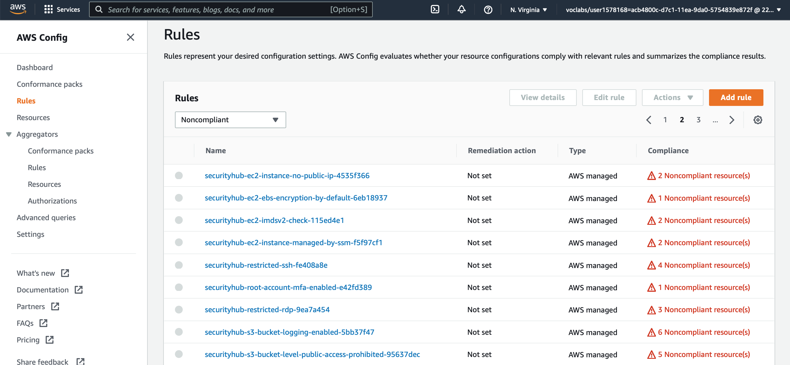
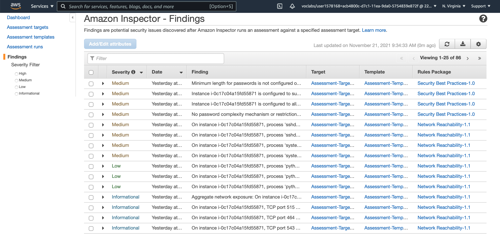
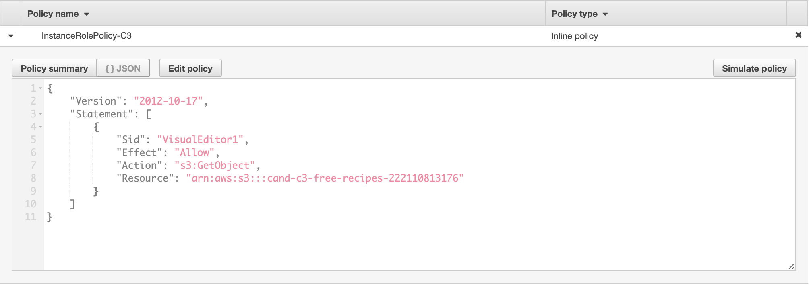
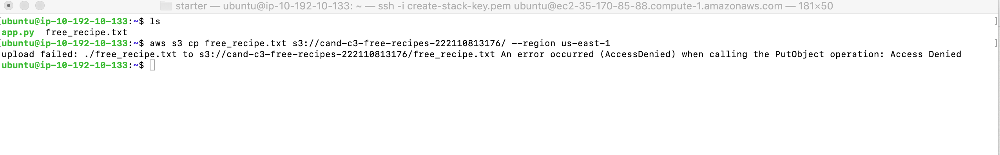
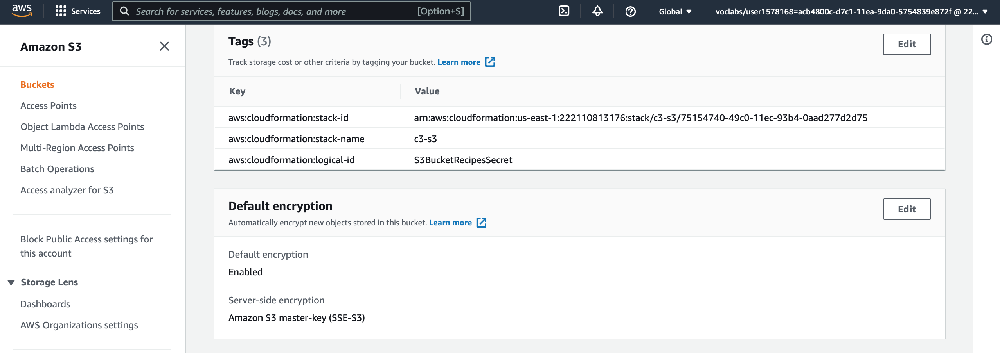
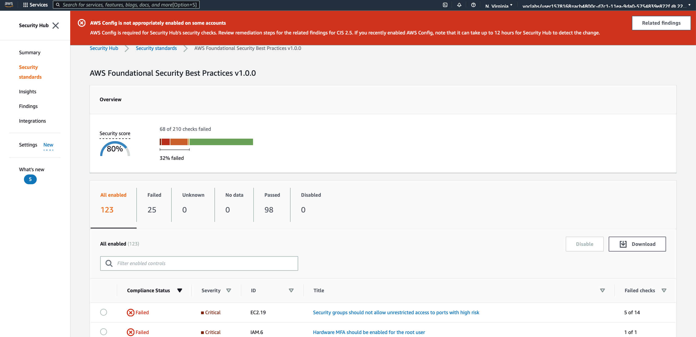

# Cloud Security - Secure the Recipe Vault Web Application
 
Project goals:
 
* Deploy and assess a simple web application environment’s security posture
* Test the security of the environment by simulating attack scenarios and exploiting cloud configuration vulnerabilities
* Implement monitoring to identify insecure configurations and malicious activity 
* Apply methods learned in the course to harden and secure the environment
* Design a DevSecOps pipeline
 
Instructions for this project are available in [this GitHub repo](https://github.com/udacity/nd063-c3-design-for-security-project-starter)

## Exercise 1 - Review Architecture Diagram
 

# Poor practice 1
This architecture  is not using private subnets therefore it exposes the servers to malicious traffic. The web server instance should be in a private subnet with firewall in place to only allow traffic from the AppLoadBalancer SG. This could be done by setting up the Security Group rules.
 
The  AppLoadBalancer SG should also have a rule to only allow traffic from 0.0.0.0 port 80 and 443.

# Poor practice 2
At the moment The users are not authenticated against any identity provider. To secure this app and differentiate the users who have a privileged access, the users should need to be authenticated with an External Identity Provider. Once authenticated, the users will be provided an IAM role with temporary API credentials that will allow them to get access to the API.

# Poor practice 3
At present none of the S3 buckets are encrypted. To add a layer of encryption the default encryption should be set up on the S3 bucket. 
The S3 buckets should also have bucket policy that allows only specific role to get access to the content.

## Exercise 2 - Identify Vulnerabilities By Reviewing Security Monitoring Tools

#### AWS Config: Non Compliant Rules

- Rule: securityhub-s3-bucket-logging-enabled-5bb37f47

Description :  Checks whether logging is enabled for your S3 buckets. 

Resources: Free recipes, secret recipes, VPC flow log S3 bucket 

Remediation : Enable logging on the S3 buckets

- Rule: securityhub-s3-bucket-ssl-requests-only-58294c2c

Description:  Checks whether S3 buckets have policies that require requests to use Secure Socket Layer (SSL). 

Resources: All S3 buckets

Remediation : In bucket policies explicitly deny access to HTTP requests

- Rule: securityhub-s3-bucket-server-side-encryption-enabled-bbb0c88d

Description:  Checks that your Amazon S3 bucket either has Amazon S3 default encryption enabled or that the S3 bucket policy explicitly denies put-object requests without server side encryption.

Resources: All S3 buckets

Remediation: Check option of default encryption

- Rule: securityhub-ec2-instance-managed-by-ssm-f5f97cf1

Description:  Checks whether the Amazon EC2 instances in your account are managed by AWS Systems Manager. 

Resource: EC2 Web Service Instance, Attack Instance

Recommendation : Make sure E2 instance is managed by AWS Systems Manager

- Rule: securityhub-encrypted-volumes-0e588c69

Description:  Checks whether the EBS volumes that are in an attached state are encrypted. If you specify the ID of a KMS key for encryption using the kmsId parameter, the rule checks if the EBS volumes in an attached state are encrypted with that KMS key. 

Resource: EC2 Volume 

- Rule: securityhub-alb-http-to-https-redirection-check-0d7cab14

Description:  Checks whether HTTP to HTTPS redirection is configured on all HTTP listeners of Application Load Balancers. The rule is NON_COMPLIANT if one or more HTTP listeners of Application Load Balancers do not have HTTP to HTTPS redirection configured. 

Resource : ElasticLoadBalancingV2 LoadBalancer Web service

Recommendation : Ensure that Load Balancers (ALBs) are configured to redirect HTTP traffic (port 80) to HTTPS (port 443).

#### Amazon Inspector: Findings 

### Rules Package: Security Best Practices-1.0 

- Finding: Web Service EC2 Instance is configured to support password authentication over SSH. Password authentication is susceptible to brute-force attacks and should be disabled in favor of key-based authentication where possible.
Description: This rule helps determine whether your EC2 instances are configured to support password authentication over the SSH protocol.

Remediation : Disable password authentication over SSH on your EC2 instances and enable support for key-based authentication instead.

- Finding: Web Service EC2 Instance is configured tallow users to log in with root credentials over SSH, without having to use a command authenticated by a public key. This increases the likelihood of a successful brute-force attack.
Description: This rule helps determine whether the SSH daemon is configured to permit logging in to your EC2 instance as root.

Remediation: Disable SSH root account logins on EC2 instance to prevent root account logins over SSH

### Rules package: Network Reachability-1.1 

- Finding: On instance i-0c17c04a15fd55871, process 'systemd-network' is listening on UDP port 68 which is associated with 'DHCP' and is reachable from the internet

Recommendation: You can edit the Security Group sg-09bf1e7a71cf887b7  to remove access from the internet on port 68

- Finding: On Web Service EC2 Instance, process 'sshd' is listening on TCP port 22 which is associated with 'SSH' and is reachable from the internet

Recommendation: Edit security sg-09bf1e7a71cf887b7 to remove access from the internet on port 22

#### Security Hub: Findings

- Finding: S3 Buckets (Secret Recipes + Free Recipes + VPC flow log) buckets should have server-side encryption enabled: 

- Finding: Security groups WebAppSG shouldn't allow ingress from 0.0.0.0/0 to port 3389 & 22

- Finding: EC2 instances should not have a public IPv4 address
 
## Exercise 3 - Attack Simulation

Run scripts that will simulate the following attack conditions: Making an SSH connection to the application server using brute force password cracking. 
Capturing secret recipe files from the s3 bucket using stolen API keys.

1. What findings were detected related to the brute force attack?
 
 a. GuardDuty should have found that Web Service instance allows SSH password and Web Service instance security group allows login SSH traffic and is open to the world.

2. Research the AWS Guard Duty documentation page and explain how GuardDuty may have detected this attack - i.e. what was its source of information?
 
 a.   GuardDuty is collecting and analysing the data coming from: VPC flow logs, AWS CloudTrail management event logs, Cloud trail S3 data event logs, and DNS logs.
 
 b. GuardDuty should have detected the attack through the VPC flow logs.

## Exercise 4 - Implement Security Hardening

### Remediation plan

1. Identify 2-3 changes that can be made to our environment to prevent an ssh brute force attack from the internet.

a. We should remove SSH inbound rule on the WebAppSG Security Group

b. We should create a private subnet inside the VPC to host the Web Service instance and allow inbound traffic from the application load balancer

c. We should update Network Access Control List (NACL) in the private subnet to block inbound SSH traffic

d. We should block traffic from 0.0.0.0/0 except from port 80 and block port 22 in particular)

e. We should update the AppLoadBalancerSG to only allow outbound traffic to the WebAppSG

2. Neither instance should have had access to the secret recipes bucket, in the even that instance API credentials were compromised how could we have prevented access to sensitive data.

a. Allow Default encryption

b. Update the c3-app-InstanceRole-13B91VKMQ3TWH IAM role policy to only allow read operations to the S3 public recipe buckets (S3 resource)

c. Update S3 bucket policy to only allow Read operations from a specific instance

Update the IAM policy for the instance profile role used by the web application instance to only allow read access to the free recipes S3 bucket.

Failed copy attempt following the updated IAM policy:

Set up default encryption to S3 secret recipe bucket:

Security Hub after reevaluating the number of findings:

### Questions and Analysis

1. What additional architectural change can be made to reduce the internet-facing attack surface of the web application instance

Answer :

a. Move the web server EC2 instance from the public subnet to a private subnet

b. Add IAM policy for S3 bucket to restrict read operation from a specific role

c. Create Network ACL (NACL) rule to reject / refuse specific traffic

d. Add a NAT gateway or a Web Proxy Layer to restrict egress traffic

e. Set up web Application Firewalls to restrict control of  bot traffic and block common attack patterns, such as SQL injection or cross-site scripting

2. Assuming the IAM permissions for the S3 bucket are still insecure, would creating VPC private endpoints for S3 prevent the unauthorized access to the secrets bucket

Answer : Moving the endpoint for S3 to a private subnet would only prevent traffic coming from outside the VPC.

3. Will applying default encryption setting to the s3 buckets encrypt the data that already exists?

Answer : No,It won't.  There won't be any  change to the encryption of the objects that existed in the bucket before default encryption was enabled. 

4. The changes you made above were done through the console or CLI; describe the outcome if the original cloud formation templates are applied to this environment?

Answer : The original cloud formation will overwrite the changes done on the Security Groups, SSH password disabled, IAM role restrictions. In order to apply the changes to the environment, the cloud formation template would need to be updated.

## Exercise 5 - Designing a DevSecOps Pipeline

### Design a DevSecOps pipeline

# Identify tools that will allow you to do the following:

### Tools and Documentation

## a. Scan infrastructure as code templates

### Tools:

- Checkov
- TFLint
- Terrafirma
- CloudSploit

### Example vulnerability
- VPC flow logging disabled 
- S3 bucket not encrypted
- EBS volume encryption disabled

## b. Scan AMI’s or containers for OS vulnerabilities

### Tools:
- Anchore
- Dagda
- OpenSCAP

### Example vulnerability
- Embedded clear text secrets
- Use of untrusted images
- Defects in Image Configuration

## c. Scan an AWS environment for cloud configuration vulnerabilities

### Tools:
- AWS Config
- Cloud Custodian
- Prowler

### Example vulnerability
- Configuration changes on KMS, IAM policy
- Data not encrypted
